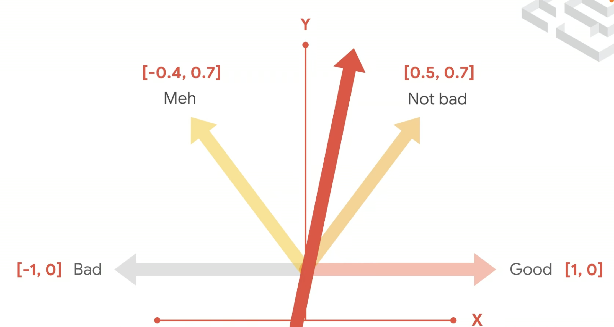

1.  Tokenize words

    ```
    import tensorflow as tf
    from tensorflow import keras
    from tensorflow.keras.preprocessing.text import Tokenizer

    sentences = [
        'i love my dog',
        'I, love my cat',
        'You love my dog!'
    ]

    tokenizer = Tokenizer(num_words = 100)
    tokenizer.fit_on_texts(sentences)
    word_index = tokenizer.word_index
    print(word_index)
    ```

2.  Sequencing — Turning sentences into data 对文本分词之后，组织成序列

    ```
    import tensorflow as tf
    from tensorflow import keras
    from tensorflow.keras.preprocessing.text import Tokenizer
    from tensorflow.keras.preprocessing.sequence import pad_sequences

    sentences = [
        'I love my dog',
        'I love my cat',
        'You love my dog!',
        'Do you think my dog is amazing?'
    ]

    tokenizer = Tokenizer(num_words = 100, oov_token="<OOV>")
    tokenizer.fit_on_texts(sentences)
    word_index = tokenizer.word_index

    sequences = tokenizer.texts_to_sequences(sentences)

    padded = pad_sequences(sequences, maxlen=5)
    print("\nWord Index = " , word_index)
    print("\nSequences = " , sequences)
    print("\nPadded Sequences:")
    print(padded)

    # Try with words that the tokenizer wasn't fit to
    test_data = [
        'i really love my dog',
        'my dog loves my manatee'
    ]

    test_seq = tokenizer.texts_to_sequences(test_data)
    print("\nTest Sequence = ", test_seq)

    padded = pad_sequences(test_seq, maxlen=10)
    print("\nPadded Test Sequence: ")
    print(padded)
    ```

3.  Train a model to recognize sentiment in text 用获得的文本数据训练神经网络
    用于训练的 dataset：
    [Sarcasm in News Headlines Dataset\_ by Rishabh Misra](http://rishabhmisra.github.io/publications/)

    (1). Tranform Json data format to Python data format

    ```
    import json

    with open ("sarcasm.json", 'r') as f
    datastore = json.load(f)

    sentences = []
    labels = []
    urls = []
    for item in datastore:
    sentences.append (item[ 'headline'])
    labels.append (item[ 'is_sarcastic'])
    urls.append (item[ 'article_link'])
    ```

    (2). Familiarize processing of our texts

    ```
    from tensorflow.keras.preprocessing.text import Tokenizer
    from tensorflow.keras.preprocessing.sequence import pad_sequences

    tokenizer = Tokenizer(oov_token="")
    tokenizer.fit_on_texts(sentences)

    word_index = tokenizer.word_index
    print(len(word_index))
    print(word_index)
    sequences = tokenizer.texts_to_sequences(sentences)
    padded = pad_sequences(sequences, padding='post')
    print(padded[0])
    print(padded.shape)
    ```

(3). Slicing the tokenized sequences to training and test sets

```
training_sentences = sentences[0:training_size]
testing_sentences = sentences[training_size:]
training_labels = labels[0:training_size]
testing_labels = labels[training_size:]
```

(4) Make sure the neural-network only saw the training data but not the testing data.</br>
code for creating training and testing datasets seperately:

```
tokenizer = Tokenizer(num_words=vocab_size, oov_token=oov_tok)
tokenizer.fit_on_texts(training_sentences)

word_index = tokenizer.word_index

training_sequences = tokenizer.texts_to_sequences(training_sentences)
training_padded = pad_sequences (training_sequences, maxlen=max_length,
                          padding=padding_type, truncating=trunc_type)

testing_sequences = tokenizer.texts_to_sequences(testing_sentences)
testing_padded = pad_sequences (testing_sequences, maxlen-max_length,
                          padding=padding_type, truncating=trunc_type)
```

(5) How to judge the sentiments after tokenizing the words? 对词进行编码之后，如何判断情绪呢？

**Embedding:**


    ```
    # Run this to ensure TensorFlow 2.x is used
    try:
      # %tensorflow_version only exists in Colab.
      %tensorflow_version 2.x
    except Exception:
      pass

    import json
    import tensorflow as tf

    from tensorflow.keras.preprocessing.text import Tokenizer
    from tensorflow.keras.preprocessing.sequence import pad_sequences

    vocab_size = 10000
    embedding_dim = 16
    max_length = 100
    trunc_type='post'
    padding_type='post'
    oov_tok = "<OOV>"
    training_size = 20000

    !wget --no-check-certificate \
        https://storage.googleapis.com/learning-datasets/sarcasm.json \
        -O /tmp/sarcasm.json

    with open("/tmp/sarcasm.json", 'r') as f:
        datastore = json.load(f)

    sentences = []
    labels = []

    for item in datastore:
        sentences.append(item['headline'])
        labels.append(item['is_sarcastic'])

    training_sentences = sentences[0:training_size]
    testing_sentences = sentences[training_size:]
    training_labels = labels[0:training_size]
    testing_labels = labels[training_size:]

    tokenizer = Tokenizer(num_words=vocab_size, oov_token=oov_tok)
    tokenizer.fit_on_texts(training_sentences)

    word_index = tokenizer.word_index

    training_sequences = tokenizer.texts_to_sequences(training_sentences)
    training_padded = pad_sequences(training_sequences, maxlen=max_length, padding=padding_type, truncating=trunc_type)

    testing_sequences = tokenizer.texts_to_sequences(testing_sentences)
    testing_padded = pad_sequences(testing_sequences, maxlen=max_length, padding=padding_type, truncating=trunc_type)

    # Need this block to get it to work with TensorFlow 2.x
    import numpy as np
    training_padded = np.array(training_padded)
    training_labels = np.array(training_labels)
    testing_padded = np.array(testing_padded)
    testing_labels = np.array(testing_labels)

    model = tf.keras.Sequential([
        tf.keras.layers.Embedding(vocab_size, embedding_dim, input_length=max_length),
        tf.keras.layers.GlobalAveragePooling1D(),
        tf.keras.layers.Dense(24, activation='relu'),
        tf.keras.layers.Dense(1, activation='sigmoid')
    ])
    model.compile(loss='binary_crossentropy',optimizer='adam',metrics=['accuracy'])

    model.summary()

    num_epochs = 30
    history = model.fit(training_padded, training_labels, epochs=num_epochs, validation_data=(testing_padded, testing_labels), verbose=2)

    import matplotlib.pyplot as plt

    def plot_graphs(history, string):
      plt.plot(history.history[string])
      plt.plot(history.history['val_'+string])
      plt.xlabel("Epochs")
      plt.ylabel(string)
      plt.legend([string, 'val_'+string])
      plt.show()

    plot_graphs(history, "accuracy")
    plot_graphs(history, "loss")

    reverse_word_index = dict([(value, key) for (key, value) in word_index.items()])

    def decode_sentence(text):
        return ' '.join([reverse_word_index.get(i, '?') for i in text])

    print(decode_sentence(training_padded[0]))
    print(training_sentences[2])
    print(labels[2])

    e = model.layers[0]
    weights = e.get_weights()[0]
    print(weights.shape) # shape: (vocab_size, embedding_dim)

    import io

    out_v = io.open('vecs.tsv', 'w', encoding='utf-8')
    out_m = io.open('meta.tsv', 'w', encoding='utf-8')
    for word_num in range(1, vocab_size):
      word = reverse_word_index[word_num]
      embeddings = weights[word_num]
      out_m.write(word + "\n")
      out_v.write('\t'.join([str(x) for x in embeddings]) + "\n")
    out_v.close()
    out_m.close()

    try:
      from google.colab import files
    except ImportError:
      pass
    else:
      files.download('vecs.tsv')
      files.download('meta.tsv')

    sentence = ["granny starting to fear spiders in the garden might be real", "game of thrones season finale showing this sunday night"]
    sequences = tokenizer.texts_to_sequences(sentence)
    padded = pad_sequences(sequences, maxlen=max_length, padding=padding_type, truncating=trunc_type)
    print(model.predict(padded))
    ```
